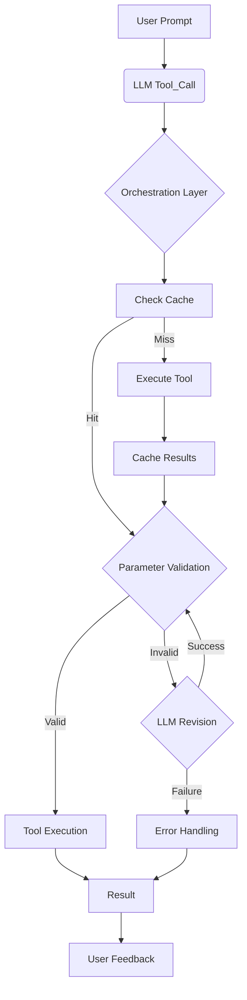

# Orchestration Layer for Tool Calls

## Overview

The orchestration layer manages tool calls with dependency management and parameter validation. It ensures that each tool is executed only after its prerequisites are met and that all parameters are validated for both structure and content.

### Orchestration Flow


## Components

### Cache Hierarchy

The cache hierarchy provides a structured way to store and retrieve data at different levels:

- **Database-level cache**: Stores database information (implemented in `DBInfoCache`)
- **Schema-level cache**: Stores schema information for each database
- **Table-level cache**: Stores table information for each schema
- **Script-level cache**: Stores script information

Each cache level uses a hierarchical key structure:
- Database: `db:{db_name}`
- Schema: `db:{db_name}:schema:{schema_name}`
- Table: `db:{db_name}:schema:{schema_name}:table:{table_name}`
- Script: `script:{script_id}`

### Dependency Management

The dependency management system tracks dependencies between tools and ensures they are executed in the correct order:

- **DependencyGraph**: Defines the dependency relationships between tools
- **DependencyResolver**: Resolves dependencies and determines execution order

Tool dependencies are defined as follows:
- **discover_databases**: No dependencies (foundational tool)
- **get_schema_information**: Requires output from discover_databases
- **get_table_information**: Requires output from discover_databases and get_schema_information
- **get_script_information**: Requires output from discover_databases
- **get_script_details**: Requires output from get_script_information
- **get_custom_functions**: Requires output from discover_databases

### Orchestration Engine

The orchestration engine coordinates tool calls, checks dependencies, and manages the cache:

- **Orchestrator**: Main coordination class
- **ToolRunner**: Handles individual tool execution
- **CacheChecker**: Manages cache lookups

### Integration

The integration module connects the orchestration engine with the existing validation system:

- **OrchestrationMCPServerStdio**: Extends `ValidatingMCPServerStdio` to add orchestration capabilities

## Usage

To use the orchestration layer, replace `ValidatingMCPServerStdio` with `OrchestrationMCPServerStdio` in your code:

```python
from orchestration import OrchestrationMCPServerStdio

async with OrchestrationMCPServerStdio(
    name="Filemaker Inspector",
    params={
        "command": "uv",
        "args": [
            "--directory", mcp_server_path,
            "run", "main.py",
            "--ddr-path", ddrPath
        ],
    },
) as server:
    # Use the server as normal
    # The orchestration layer will handle dependencies and validation
```

## Testing

The orchestration layer includes a test script that verifies its functionality:

```bash
python -m orchestration.test_orchestration
```

This test:
1. Clears all caches
2. Calls `get_table_information` directly
3. Verifies that `discover_databases` and `get_schema_information` are called first

## Benefits

The orchestration layer provides several benefits:

- **Automatic dependency resolution**: Tools are executed in the correct order
- **Efficient caching**: Results are cached at the appropriate level
- **Parameter validation**: Parameters are validated before execution
- **Error handling**: Errors are handled gracefully with informative messages
- **Improved user experience**: Users don't need to know the correct order of tool calls