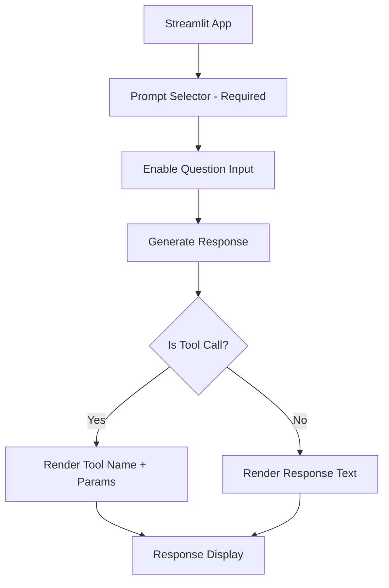

# Streamlit Testing Environment Plan

## Overview
A Streamlit application for testing prompt responses and tool call parameters without execution.

## Requirements
1. Mandatory prompt selection before testing
2. Display either:
   - Regular text responses
   - Tool call details (without execution)
3. Prevent actual tool execution

## Flow Diagram


## Implementation Details

### File Structure
```
prompts/test/
├── streamlit_test_app.py (main application)
└── test_utils.py (helper functions)
```

### Core Components
1. **Prompt Selection**
   - Dropdown populated from prompts.py
   - Required before any other action
   - Disables other inputs until selected

2. **Question Input**
   - Text area for test questions
   - Only enabled after prompt selection

3. **Response Display**
   - Shows either:
     - Plain text responses
     - Formatted tool call details (JSON)
   - Never executes actual tools

### Safety Features
- Tool call interception
- Execution prevention
- Clear visual distinction between text and tool responses

## Next Steps
Ready to implement in code mode.